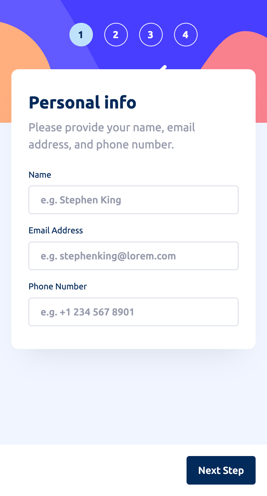
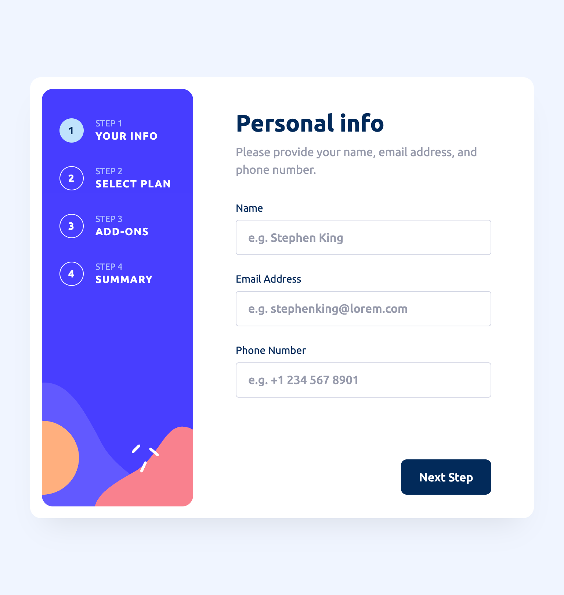
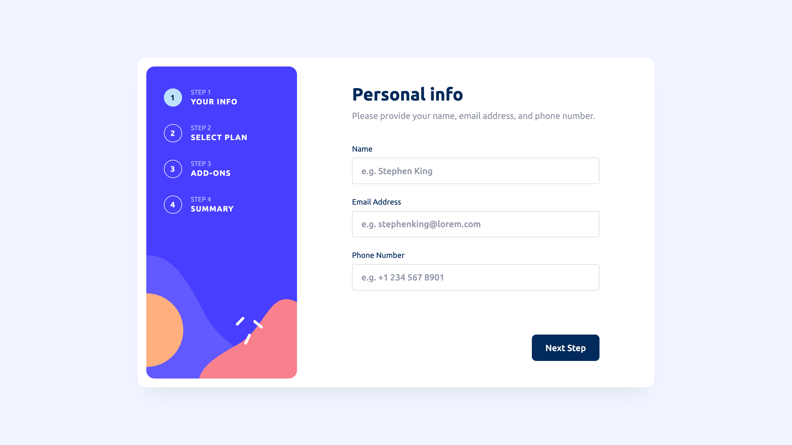

# Frontend Mentor - Multi-step form solution

This is a solution to the [Multi-step form challenge on Frontend Mentor](https://www.frontendmentor.io/challenges/multistep-form-YVAnSdqQBJ). Frontend Mentor challenges help you improve your coding skills by building realistic projects.

I am completing this challenge as part of the [Introduction to front-end testing](https://www.frontendmentor.io/learning-paths/introduction-to-front-end-testing-kacF_IJQO5) Frontend Mentor learning path. This continues my efforts to learn my chosen JS Framework - [Vue.js](https://vuejs.org/) + [Pinia](https://pinia.vuejs.org/). And now my more specific goal for this challenge was to learn to incorporate [end-to-end tests](https://www.frontendmentor.io/learning-paths/introduction-to-front-end-testing-kacF_IJQO5/steps/689e5149d98fffca3e5870a6/article/read).

## Table of contents

- [Overview](#overview)
  - [The challenge](#the-challenge)
  - [Screenshots](#screenshots)
  - [Links](#links)
- [My process](#my-process)
  - [Built with](#built-with)
  - [What I learned](#what-i-learned)
  - [Continued development](#continued-development)
  - [Useful resources](#useful-resources)
- [Author](#author)

## Overview

### The challenge

Users should be able to:

- Complete each step of the sequence
- Go back to a previous step to update their selections
- See a summary of their selections on the final step and confirm their order
- View the optimal layout for the interface depending on their device's screen size
- See hover and focus states for all interactive elements on the page
- Receive form validation messages if:
  - A field has been missed
  - The email address is not formatted correctly
  - A step is submitted, but no selection has been made

### Screenshots

|        Mobile designed at 375px:         |        Tablet designed at 1440px:        | Desktop designed at 1440px:               |
| :--------------------------------------: | :--------------------------------------: | ----------------------------------------- |
|  |  |  |

### Links

- Solution URL: [https://github.com/elisilk/multi-step-form](https://github.com/elisilk/multi-step-form)
- Live Site URL: [https://elisilk.github.io/multi-step-form/](https://elisilk.github.io/multi-step-form/)

## My process

### Built with

- Semantic HTML5 markup
- CSS custom properties
- Flexbox
- CSS Grid
- Mobile-first workflow
- Accessibility
- [Vite](https://vite.dev/)
- [Vue](https://vuejs.org/)
- [Pinia](https://pinia.vuejs.org/)
- [Vue Router](https://router.vuejs.org/)
- [Vitest](https://vitest.dev/guide/)
- [Vue Test Utils](https://test-utils.vuejs.org/guide/)

### What I learned

As always, so many cool :sunglasses: things. Here are some of the key resources I used.

#### Testing the App

Hmm 🤔 ...

- [Playwright](https://playwright.dev/)
  - [Playwright Getting Started](https://playwright.dev/docs/intro)
  - [Locators](https://playwright.dev/docs/locators)
  - [Actions](https://playwright.dev/docs/input)
  - [Assertions](https://playwright.dev/docs/test-assertions)
  - [Best Practices](https://playwright.dev/docs/best-practices)
- [Getting started with end-to-end testing with Playwright](https://learn.microsoft.com/en-us/shows/getting-started-with-end-to-end-testing-with-playwright/)
- [Playwright Testing Essentials: A Beginner's Guide](https://betterstack.com/community/guides/testing/playwright-intro/)
- [Playwright End-to-End Testing: A Step-by-Step Guide](https://betterstack.com/community/guides/testing/playwright-end-to-end-testing/)
- [9 Playwright Best Practices and Pitfalls to Avoid](https://betterstack.com/community/guides/testing/playwright-best-practices/)

#### Building the App

- Multi-Page Forms
  - [Building a Multi-Step Form with Petite-Vue](https://vueschool.io/articles/vuejs-tutorials/building-a-multi-step-form-with-petite-vue/)
  - [The Vue Form Component Pattern: Robust Forms Without the Fuss](https://vueschool.io/articles/vuejs-tutorials/the-vue-form-component-pattern-robust-forms-without-the-fuss/)
  - [How to build Multi Step Form in Vue.js](https://dev.to/yogeshgalav7/how-to-build-multi-step-form-in-vuejs-4n5b)
    - [Vue Multi Step Form](https://github.com/yogeshgalav/vue-multi-step-form)
  - [Building a Multi-Step Form with Vue](https://medium.com/engineering-samlino/building-a-multi-step-form-with-vue-2bc861447c4a)
  - [W3C WAI > Multi-page Forms](https://www.w3.org/WAI/tutorials/forms/multi-page/)
  - [FormKit > Build a multi-step form](https://formkit.com/guides/build-a-multi-step-form)
  - [How to Create Multi-Step Forms With Vanilla JavaScript and CSS](https://css-tricks.com/how-to-create-multi-step-forms-with-vanilla-javascript-and-css/) and [GitHub Repository](https://github.com/FatumaA/mulit-step-form/tree/master)
- Vue
  - [Slots](https://vuejs.org/guide/components/slots.html)
  - [SFC CSS Features](https://vuejs.org/api/sfc-css-features)
- Vue Emit + Provide/Inject
  - [Understanding Vue.js ( emit ): A Complete Guide](https://asfakahmedsblog.hashnode.dev/understanding-vuejs-emit-a-complete-guide)
  - [Provide / Inject](https://vuejs.org/guide/components/provide-inject)
  - [Component v-model​](https://vuejs.org/guide/components/v-model)
- Vue Composables
  - [Composables](https://vuejs.org/guide/reusability/composables.html)
  - [Good practices and Design Patterns for Vue Composables](https://dev.to/jacobandrewsky/good-practices-and-design-patterns-for-vue-composables-24lk)
- Vue Router
  - [Different History modes](https://router.vuejs.org/guide/essentials/history-mode)
  - [Programmatic Navigation](https://router.vuejs.org/guide/essentials/navigation)
- Steppers
  - [USWDS > Step indicator](https://designsystem.digital.gov/components/step-indicator/)
  - [Building A Stepper Component](https://ishadeed.com/article/stepper-component-html-css/)
  - [Solution: Progress Stepper](https://piccalil.li/blog/solution-008-progress-stepper/)
  - [PrimeVue > Stepper](https://primevue.org/stepper/)
- Toggle Switches
  - [ARIA Authoring Practices Guide (APG) Switch Example](https://www.w3.org/WAI/ARIA/apg/patterns/switch/examples/switch/)
  - [Accessible Styled Form Controls > Switch Component: Radio Buttons](https://scottaohara.github.io/a11y_styled_form_controls/src/radio-button--switch/)
    - [a11y_styled_form_controls](https://scottaohara.github.io/a11y_styled_form_controls/)
    - [The Accessibility of Styled Form Controls > GitHub source](https://github.com/scottaohara/a11y_styled_form_controls/tree/main)
  - [On Designing and Building Toggle Switches](https://www.sarasoueidan.com/blog/toggle-switch-design/)
  - [Switch Pattern](https://www.w3.org/WAI/ARIA/apg/patterns/switch/) + 3 examples
  - [Inclusive Components > Toggle Buttons](https://inclusive-components.design/toggle-button/)
  - [Replacing Radio Buttons Without Replacing Radio Buttons](https://www.sitepoint.com/replacing-radio-buttons-without-replacing-radio-buttons/)
  - [WTF, forms?](http://wtfforms.com/)
  - [Create a toggle switch using HTML & CSS](https://www.30secondsofcode.org/css/s/toggle-switch/)
- Plan Levels
  - [How to Create a Pricing Table with a Monthly/Yearly Toggle in Tailwind CSS and Vue](https://cruip.com/how-to-create-a-pricing-table-with-a-monthly-yearly-toggle-in-tailwind-css-and-vue/)
    - [Demo](https://cruip-tutorials-vue.vercel.app/pricing-table)
- HTML Elements
  - [`<input>`: The HTML Input element](https://developer.mozilla.org/en-US/docs/Web/HTML/Reference/Elements/input)
    - [`<input type="email">`](https://developer.mozilla.org/en-US/docs/Web/HTML/Reference/Elements/input/email)
    - [`<input type="tel">`](https://developer.mozilla.org/en-US/docs/Web/HTML/Reference/Elements/input/tel)
    - [HTML attribute: autocomplete](https://developer.mozilla.org/en-US/docs/Web/HTML/Reference/Attributes/autocomplete)
    - [:user-invalid](https://developer.mozilla.org/en-US/docs/Web/CSS/:user-invalid)
  - [`<output>`: The Output element](https://developer.mozilla.org/en-US/docs/Web/HTML/Reference/Elements/output)
- Regex Input Patterns
  - [regex101 - my pattern to match the characters to escape in my email pattern match](https://regex101.com/r/1O1CBv/1)
    - [Character class: [...], [^...]](https://developer.mozilla.org/en-US/docs/Web/JavaScript/Reference/Regular_expressions/Character_class)
    - [Character escape: \n, \u{...}](https://developer.mozilla.org/en-US/docs/Web/JavaScript/Reference/Regular_expressions/Character_escape)
    - [Disjunction: |](https://developer.mozilla.org/en-US/docs/Web/JavaScript/Reference/Regular_expressions/Disjunction)
    - [Lookbehind assertion: (?<=...), (?<!...)](https://developer.mozilla.org/en-US/docs/Web/JavaScript/Reference/Regular_expressions/Lookbehind_assertion)
    - [Escape a regular expression in JavaScript](https://www.30secondsofcode.org/js/s/escape-reg-exp/)
    - [Regular Expressions Cheat Sheet](https://www.30secondsofcode.org/js/s/regexp-cheatsheet/)
  - [HTML attribute: pattern](https://developer.mozilla.org/en-US/docs/Web/HTML/Reference/Attributes/pattern)
  - [String.prototype.replace()](https://developer.mozilla.org/en-US/docs/Web/JavaScript/Reference/Global_Objects/String/replace)
  - [Regular expressions](https://developer.mozilla.org/en-US/docs/Web/JavaScript/Guide/Regular_expressions)
  - [USWDS Phone number](https://designsystem.digital.gov/patterns/create-a-user-profile/phone-number/)
  - [regex for phone number](https://ihateregex.io/expr/phone/)
  - [regular expressions 101](https://regex101.com/r/j48BZs/2)
  - [Regex how to match an optional character](https://stackoverflow.com/questions/4007302/regex-how-to-match-an-optional-character)
  - [Why regex working in javascript but not as HTML5 pattern [closed]](https://stackoverflow.com/questions/73372011/why-regex-working-in-javascript-but-not-as-html5-pattern)
  - [Regular expression to match standard 10 digit phone number](https://stackoverflow.com/questions/16699007/regular-expression-to-match-standard-10-digit-phone-number)
  - [html input pattern for phone number](https://stackoverflow.com/questions/32901390/html-input-pattern-for-phone-number)
  - [HTML5 Email address input pattern attribute](https://stackoverflow.com/questions/5601647/html5-email-address-input-pattern-attribute)
  - [What regular expression will match valid international phone numbers?](https://stackoverflow.com/questions/2113908/what-regular-expression-will-match-valid-international-phone-numbers)
- Data attributes
  - [Use data attributes](https://developer.mozilla.org/en-US/docs/Web/HTML/How_to/Use_data_attributes)
- Custom counters / list numbering
  - [Using CSS counters](https://developer.mozilla.org/en-US/docs/Web/CSS/CSS_counter_styles/Using_CSS_counters)
- HTML Forms
  - [How to target non-empty but invalid input elements with CSS](https://www.stefanjudis.com/notes/target-non-empty-but-invalid-input-element-with-css/)
  - [How to set custom error messages for your HTML forms](https://www.youtube.com/watch?v=h5qqmE83Tes)
- Focus management
  - [Vue refs and lifecycle methods for focus management](https://developer.mozilla.org/en-US/docs/Learn_web_development/Core/Frameworks_libraries/Vue_refs_focus_management)
  - [Accessibility Tips: Be Cautious When Using Autofocus](https://www.boia.org/blog/accessibility-tips-be-cautious-when-using-autofocus)
  - [HTML autofocus global attribute](https://developer.mozilla.org/en-US/docs/Web/HTML/Reference/Global_attributes/autofocus)
- Great CSS resources (that I come back to regularly)
  - [Inclusively Hiding & Styling Checkboxes and Radio Buttons](https://www.sarasoueidan.com/blog/inclusively-hiding-and-styling-checkboxes-and-radio-buttons/)
  - [Keep Footer at the Bottom of the Page: HTML & CSS (2024)](https://www.youtube.com/watch?v=RYImAil3lgo&ab_channel=DmitryMayorov)
- [CSS3 selector :first-of-type with class name?](https://stackoverflow.com/questions/6447045/css3-selector-first-of-type-with-class-name)
  - [`:first-of-type`](https://developer.mozilla.org/en-US/docs/Web/CSS/:first-of-type)

### Continued development

Known issues - specific areas that the solution should be improved:

- [ ] Check that all ARIA is being used appropriately. Especially with respect to:
  - [ARIA: aria-invalid attribute](https://developer.mozilla.org/en-US/docs/Web/Accessibility/ARIA/Reference/Attributes/aria-invalid)
  - [ARIA: aria-errormessage attribute](https://developer.mozilla.org/en-US/docs/Web/Accessibility/ARIA/Reference/Attributes/aria-errormessage)

Feature requests - specific enhancements to make:

Hmm 🤔 ...

More general ideas to consider:

- [Vue Style Guide > Priority C Rules: Recommended](https://vuejs.org/style-guide/rules-recommended.html)
- [How to write Semantic CSS](https://www.youtube.com/watch?v=lWu5zf_S9R4)
- [TodoMVC](https://todomvc.com/)
- Learn and use [TypeScript](https://www.typescriptlang.org/)
- Implement a full-stack app

### Useful resources

- [Vue Guide](https://vuejs.org/guide/)
- [Pinia Guide](https://pinia.vuejs.org/core-concepts/)
- [Vite Guide](https://vite.dev/guide/)
- [MDN Web Docs for CSS](https://developer.mozilla.org/en-US/docs/Web/CSS) - Went here a lot to reference the different CSS properties and the shorthands, and all the great explanations about best practices.

## Author

- Website - [Eli Silk](https://github.com/elisilk)
- Frontend Mentor - [@elisilk](https://www.frontendmentor.io/profile/elisilk)
